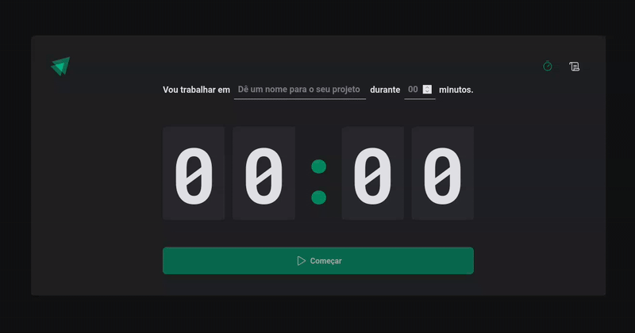

# ⏱️ Ignite Timer

Gerenciador de tarefas com controle de tempo, desenvolvido durante o curso Ignite da [Rocketseat](https://www.rocketseat.com.br/).

## 🚀 Sobre o projeto

O **Ignite Timer** é uma aplicação que permite ao usuário cadastrar tarefas com tempo estimado de execução e acompanhar seu histórico de produtividade. Ideal para quem utiliza a técnica Pomodoro ou busca uma forma simples de organizar o foco ao longo do dia.

### 📸 Demonstração

## ✨ Funcionalidades

- Criação de novas tarefas com tempo definido (em minutos);
- Contador regressivo em tempo real;
- Atualização automática do status da tarefa:
  - ⏳ Em andamento
  - ✅ Concluída
  - 🛑 Interrompida
- Histórico completo das tarefas;
- Persistência de dados no **localStorage** (mantém as informações ao recarregar ou sair da aplicação).

## 🛠️ Tecnologias utilizadas

- [React](https://reactjs.org/)
- [Vite](https://vitejs.dev/)
- [TypeScript](https://www.typescriptlang.org/)
- [React Router DOM](https://reactrouter.com/)
- [React Hook Form](https://react-hook-form.com/)
- [Zod](https://github.com/colinhacks/zod)
- [Styled-components](https://styled-components.com/)
- [Immer](https://immerjs.github.io/immer/)
- [Date-fns](https://date-fns.org/)
- [Phosphor React Icons](https://phosphoricons.com/)
- React Hooks: `useReducer`, `useContext`, `useEffect`, `useState`
